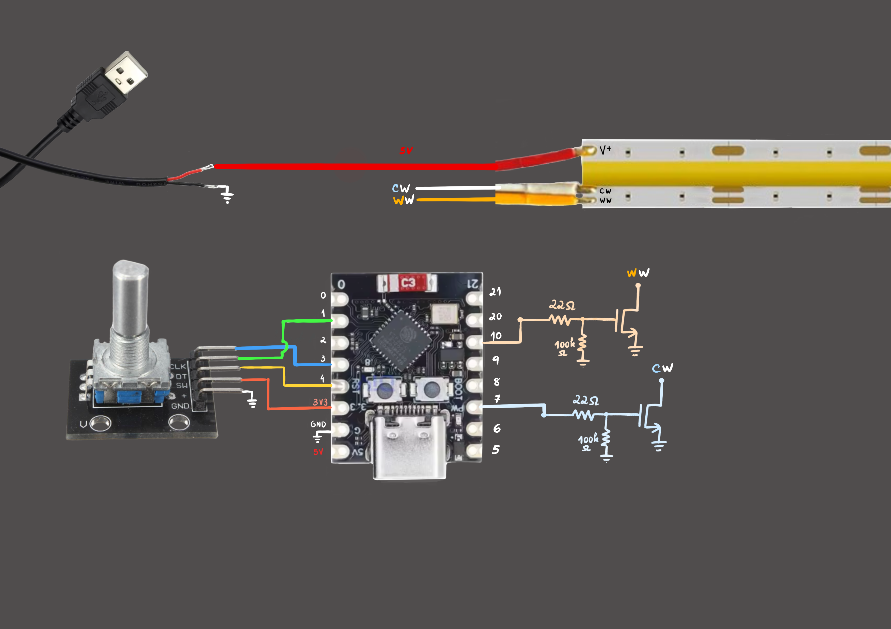

# ESP32 LED Controller (Rotary Encoder + ESPHome)

A DIY LED controller using an ESP32 with a rotary encoder for brightness and color temperature control of warm/cold white LED strips.

Supports:
- Standalone mode (no Wi-Fi / no Home Assistant)
- ESPHome integration (Home Assistant)

---

## 🎥 YouTube Video
[Watch the full build here](https://youtu.be/Z6de5To7LlU)

---

## ✨ Features

- Smooth brightness control with rotary encoder
- Long press to toggle ON/OFF
- Works offline (standalone firmware)
- Optional Wi-Fi + Home Assistant integration via ESPHome

---

## 📦 Folder Structure

- `/firmware/standalone-esp32` → Arduino / PlatformIO code
- `/esphome` → ESPHome YAML config
- `/hardware` → wiring diagram + BOM
- `/3d-models` → enclosure files

---

## 🔌 Hardware

- ESP32
- Rotary encoder (KY-040 or similar)
- 2 x [IRFL44N Mosfet Datasheet](https://www.infineon.com/assets/row/public/documents/24/49/infineon-irlz44n-datasheet-en.pdf) or similar transistor
- 2 x 22Ohm resistors
- 2 x 100kOhm resistors
- LED strip (warm/cold white LED strip - 3 pins: w, c, v+)
- Power supply

👉 See full list: [`hardware/bom.md`](hardware/bom.md)

---

## 🧵 Wiring



---

## 🚀 Option 1: Standalone Firmware

1. Open:
   ```
   firmware/standalone-esp32/standalone-esp32.ino
   ```
2. Set your GPIO pins at the beginnig
3. Upload to ESP32

---

## 🌐 Option 2: ESPHome (Home Assistant)

1. Install ESPHome
2. Open:
   ```
   esphome/led-controller.yaml
   ```
3. Update:
   - Wi-Fi credentials
   - Device name
   - GPIO pins
4. Upload to ESP32

---

## ⚠️ Notes

- Make sure your power supply matches your LED strip
- Use a common ground between ESP32 and LEDs

---

## 📜 License

MIT License
